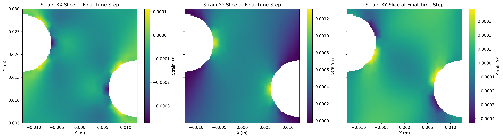
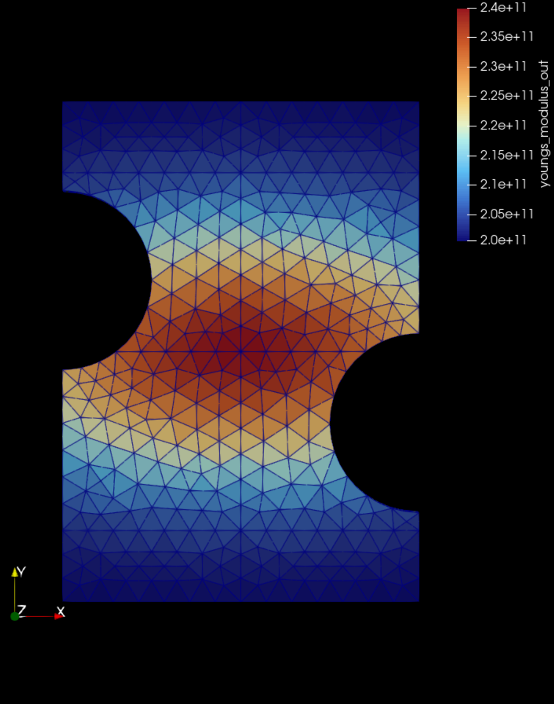
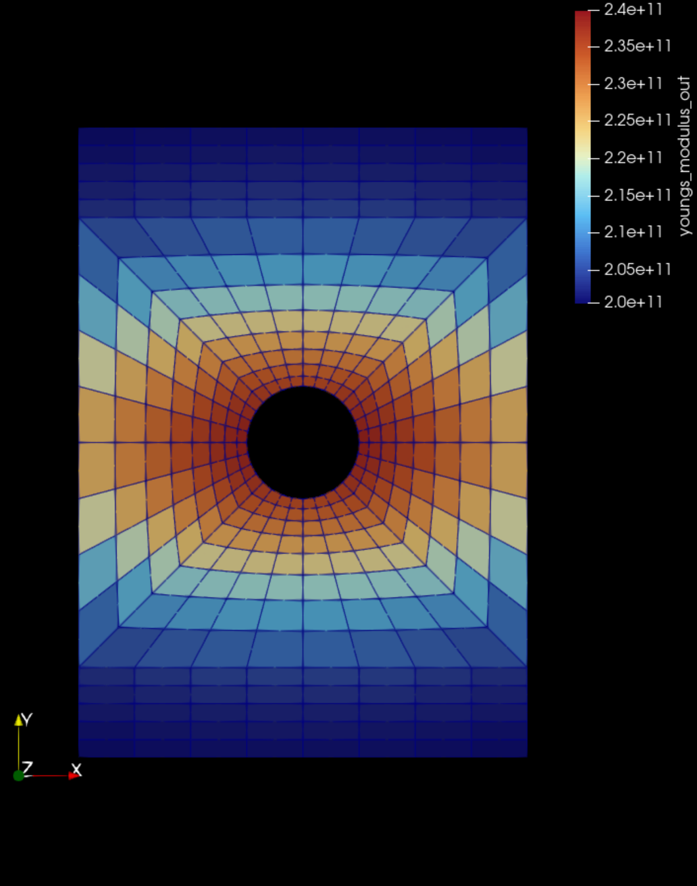
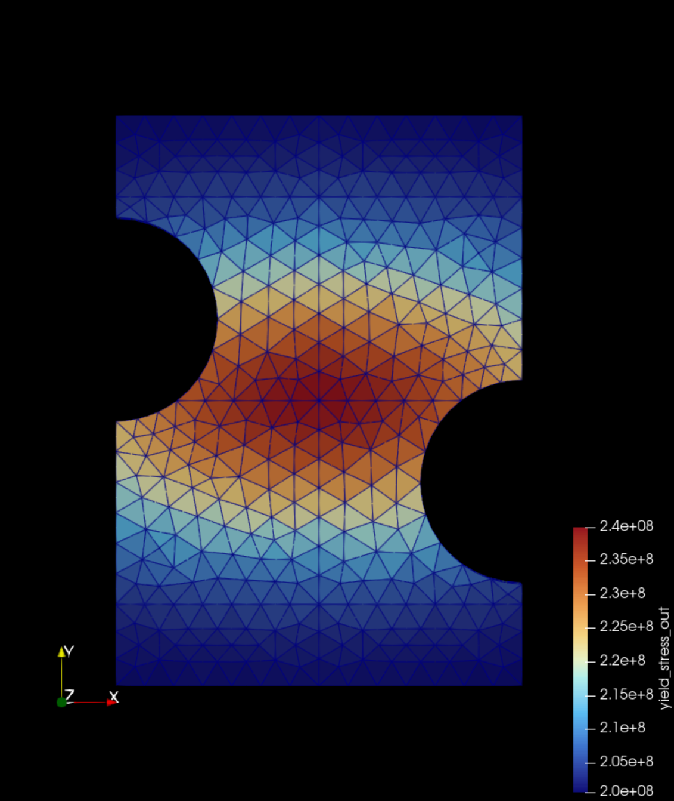
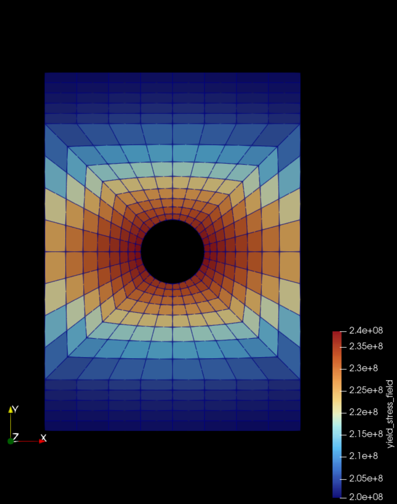
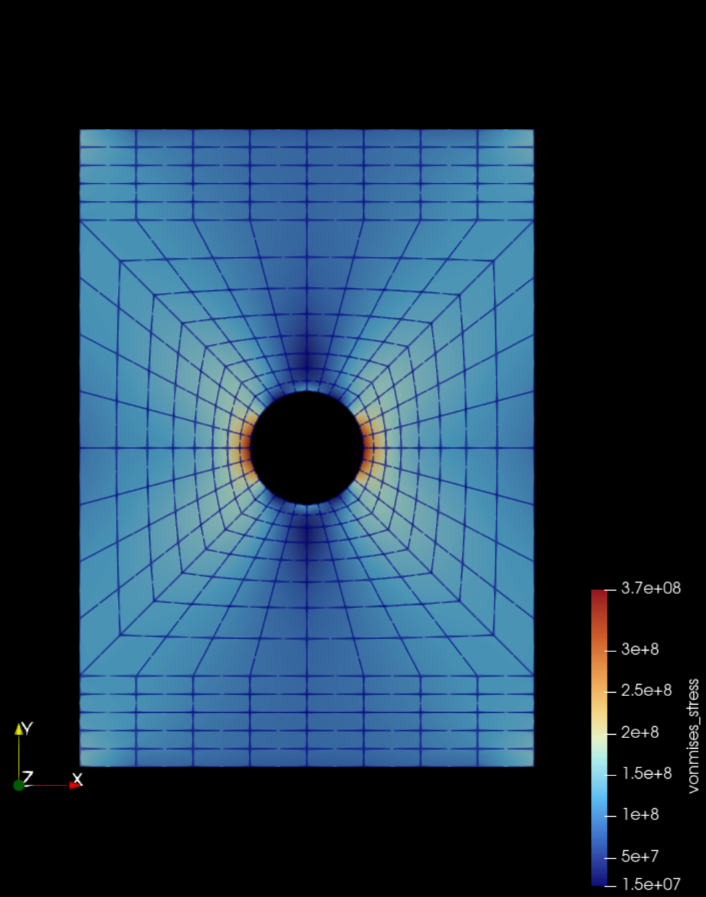
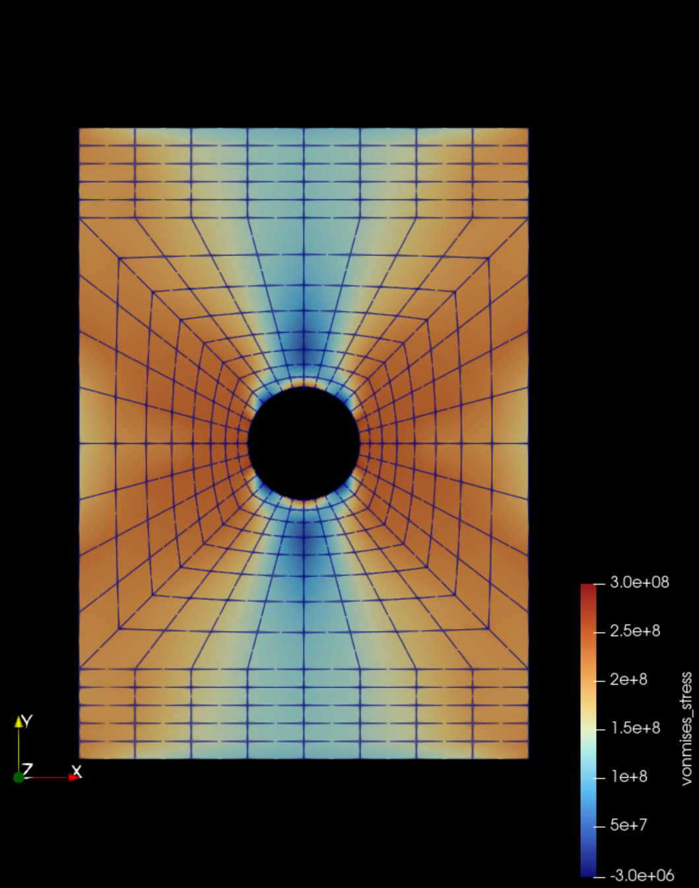
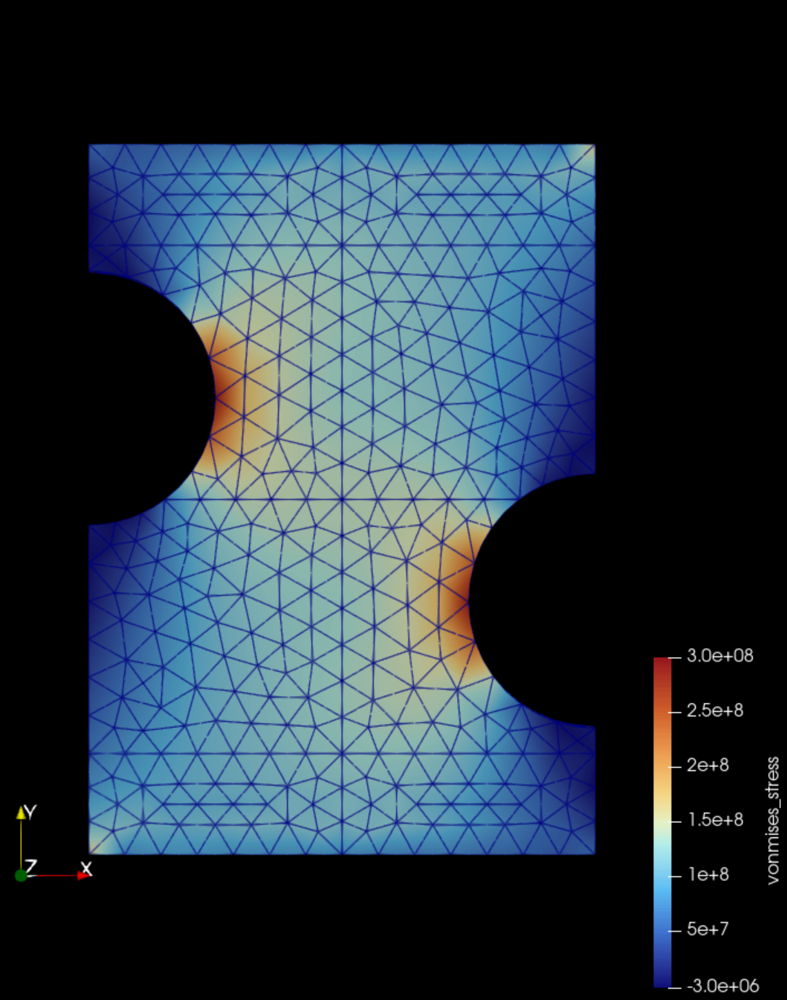
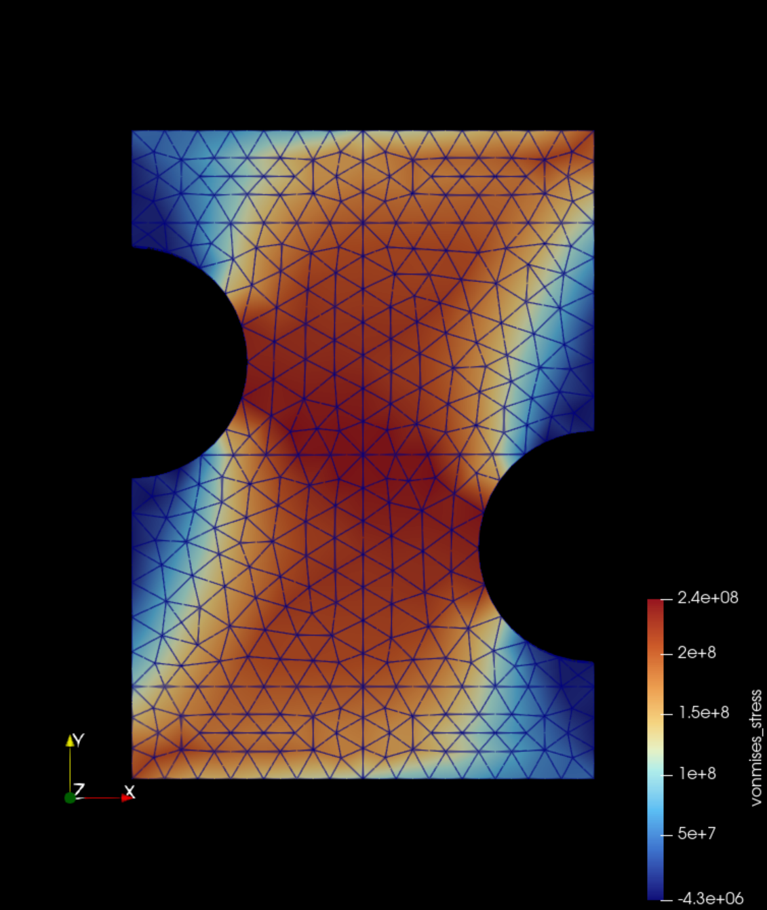

# VFM Verification Simulations
A library of finite element models for virtual fields method (VFM) verification studies. Includes simulations with elastic and plastic materials properties as well as homogeneous and heterogeneous material properties.

## Extracting Data on a Grid for the VFM
In the /scripts/ directory there is a python script called "main_load_sim.py". This script loads an exodus file from the data directory, interpolates it onto a regular grid putting nans where there is no data, then plots the strain fields as shown below:

This script can be used to generate the input strain field grids needed for testing with the VFM with an arbitrary number of grid samples. The script also shows where the load cell / force data can be extracted from the `SimData` data object for use with the VFM.

## Simulation Description
The simulation meshes wete generated with Gmsh and solver with the MOOSE solid mechanics module. The Gmsh .geo files and the MOOSE .i input scripts for all model are located in the /data/ directory. There are two meshes in the data directory: 1) a plate with a hole loaded in tension, and 2) an offset notched plate loaded in tension. Both meshes were 3D and used higher order quadratic elements. The outer dimensions of the plate for both cases is 35x20x1mm. The simulations were solved in displacement control with the bottom edge fixed and the top edge displacement vertically with a linear function over 24 time steps. The maximum vertical displacement in all cases was set to 0.05 mm.

For the hetereogeneous cases the material properties where specified using a gaussian function with a peak at the center of the plate. The spatial standard deviation was set to `stdX = plateWidth/2` and `stdY = plateWidth/4` where `plateWidth=25e-3`. For the elastic case the peak modulus was set to 240 GPa and the modulus at infinity was set to 200 GPa with a constant Poissons ratio of 0.3. For the plastic case the same spatial standard deviations were used and the elastic properties were constante at E = 200 GPa and nu = 0.3. The yield stress was hetereogeneous with a peak of Sy = 240 MPa and a yield stress at infinity of 200 MPa. Linear hardening was used with a constant hardening modulus of 1000 MPa. The distribution of material properties for both cases is shown below for the elastic hetereogeneous modulus and the plastic hetereogeneous yield stress:

| Notch Plate (Heterogeneous Elastic Modulus) | Hole Plate (Heterogeneous Elastic Modulus) |
| :---: | :---: |
|  |  |

| Notch Plate (Heterogeneous Yield Stress) | Hole Plate (Heterogeneous Yield Stress) |
| :---: | :---: |
|  |  |

The von mises stress fields for all cases are shown below:

| Hole Plate (Heterogeneous Elastic Von Mises Stress) | Hole Plate (Heterogeneous Plastic Von Mises Stress) |
| :---: | :---: |
|  |  |

| Notch Plate (Heterogeneous Elastic Von Mises Stress) | Notch Plate (Heterogeneous Plastic Von Mises Stress) |
| :---: | :---: |
|  |  |
